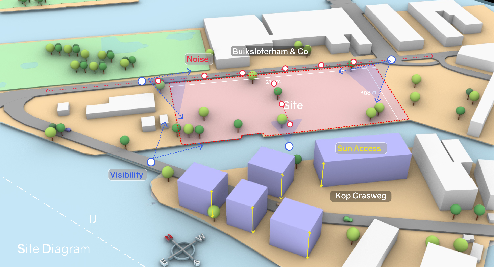

# Massing Problem

The problem of finding the appropriate volumetric design of the building is the highest level of the space layout problem. In this stage the impact of placing volumes representing the built mass on the site is studied with respect to its effect on the surrounding buildings as well as its own performance in achieving the urban level design goals.

# Aim

To generate various massing variants for the site and select a variant which will maximise the site utilization without compromising on the quality of the spaces as defined by the architect.

# Process

The massing process described further is particular to the case at hand at Buiksloterham and Co.The process taken in this step is a combination of manual design and  computational analysis and validation. The design ideas are sketched manually and the performance indicators for the sketches are programmed in a computational framework where simulations and calculations are done to quantify the indicators. Then weights are given to each criteria based on the designers validation preferences and a Multi-criteria decision analysis is done to rank and select the design variant from the sketches.This process also takes place in a methodical and ordered way in several steps as described below:

Looking at the space program two distinctions can be made regarding the massing requirements of the program.The mass encompassing the volume of Self development plots and the mass encompassing rest of the space program.

`The first step` of the process involves creating all the logical variants of the basic distribution of the two masses along with the connecting road network and running the simulations for Sunlight hours and Visibility on them.The basic intention of running these simulations is to pick an option having maximum visibility and sunlight hours on the building forms and the minimum shading of the self development plots by the buildings.

The variants where self development plots were placed in the center of the site were eliminated due to the possibility of shading due to the taller buildings surrounding them. In the visibility simulation points of interest on the IJ river Front access road and the canal where a pedestrian bridge is proposed is considered with equal weightage for visibility from all points of interest.The modelling and simulation process is done on Rhino and Grasshopper with the plugin Ladybug for environmental simulations.




